#  Liga de Baloncesto — Sistema de Gestión de Liga (TPO)

Aplicación web full-stack para la gestión integral de una liga de baloncesto: portal público para seguir la competencia (posiciones, fixture, playoffs, palmarés) y panel de administración protegido para operarla (equipos, jugadores, partidos, temporadas y branding de la liga).

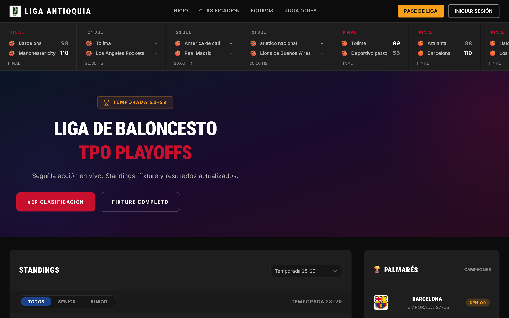

---

##  Índice

1. [Funcionalidades](#-funcionalidades)
2. [Diseño y prototipado (wireframes)](#-diseño-y-prototipado)
3. [Stack tecnológico](#-stack-tecnológico)
4. [Arquitectura](#-arquitectura)
5. [Base de datos](#-base-de-datos)
6. [Instalación y ejecución](#-instalación-y-ejecución)
7. [API — Resumen de endpoints](#-api--resumen-de-endpoints)
8. [Estructura del proyecto](#-estructura-del-proyecto)
9. [Documentación adicional](#-documentación-adicional)

---

##  Funcionalidades

### Portal público

| | |
|---|---|
| **Tabla de posiciones automática** — al cargar un resultado se recalculan PJ/W/L/E, puntos (3/1/0) y desempates (puntos → diferencia → tantos a favor), por temporada y categoría (Senior/Junior). | **Bracket de playoffs** — el top 8 del standings se cruza 1v8, 4v5, 2v7 y 3v6; los ganadores de los partidos de playoffs avanzan automáticamente hasta definir al campeón. |
| **Palmarés** — campeones históricos por temporada y categoría, alimentado por las finales realmente jugadas. | **Cinta de marcadores** estilo NBA con todos los partidos y resultados. |
| **Equipos** — cards con stats y roster expandible. | **Jugadores** — buscador por nombre + filtros por equipo y categoría combinables. |

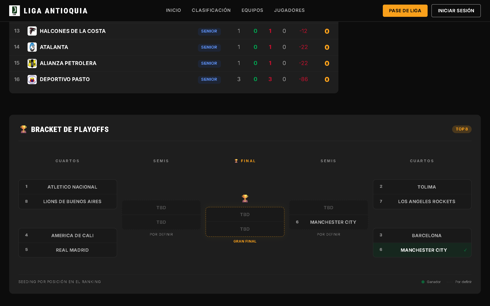

### Panel de administración (Panel VIP )

- **Partidos**: programar (con fase: temporada regular / cuartos / semis / final), reprogramar, cargar resultados y cancelar. Los partidos de playoffs se marcan con badge 🏆 y **no afectan la tabla de posiciones** (ni admiten empates).
- **Jugadores y Equipos**: CRUD completo con validaciones de integridad (categorías consistentes entre jugador y equipo, equipos no juegan contra sí mismos).
- **Temporadas**: crear una nueva temporada desactiva la anterior e inicializa las estadísticas de todos los equipos en cero (el historial se conserva).
- **Liga**: branding global (nombre + logo) editable, consumido en vivo por el navbar y el hero.

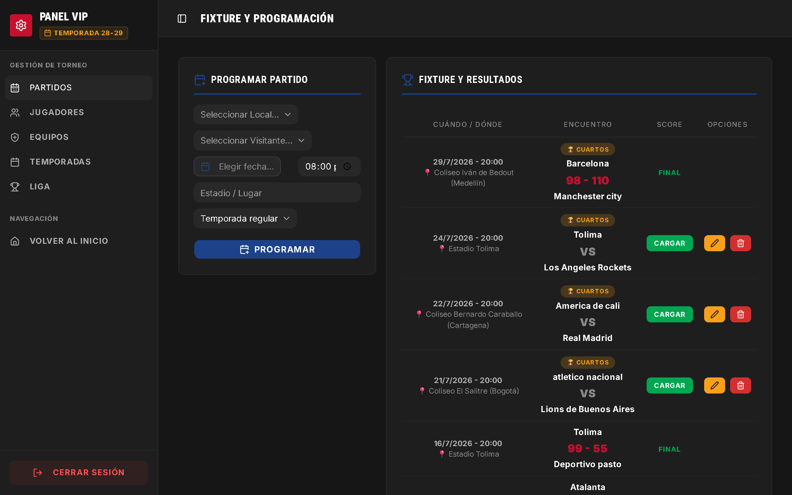

---

## Diseño y prototipado

El proyecto partió de un **wireframe mid-fi** ([PDF completo](docs/img/wireframes/wireframe-liga-basquet.pdf)) que definió la estructura de las vistas principales. Comparativa diseño propuesto → producto final:

| Wireframe | Producto final |
|---|---|
| 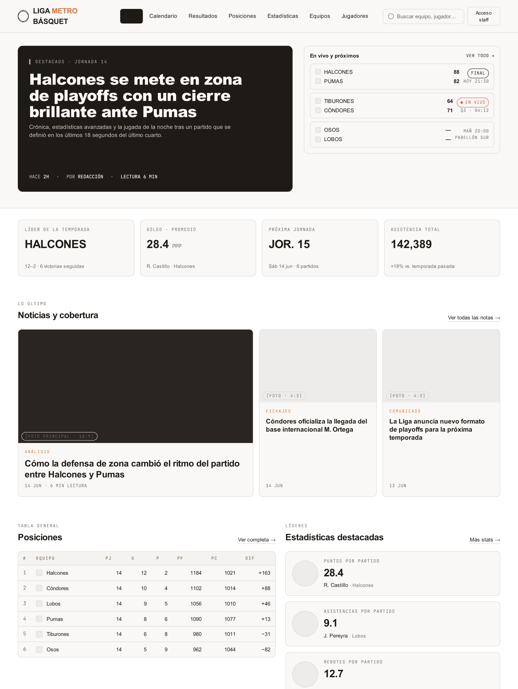 |  |
| 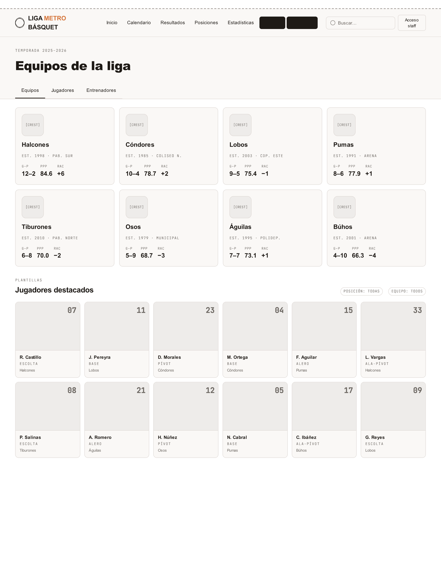 | 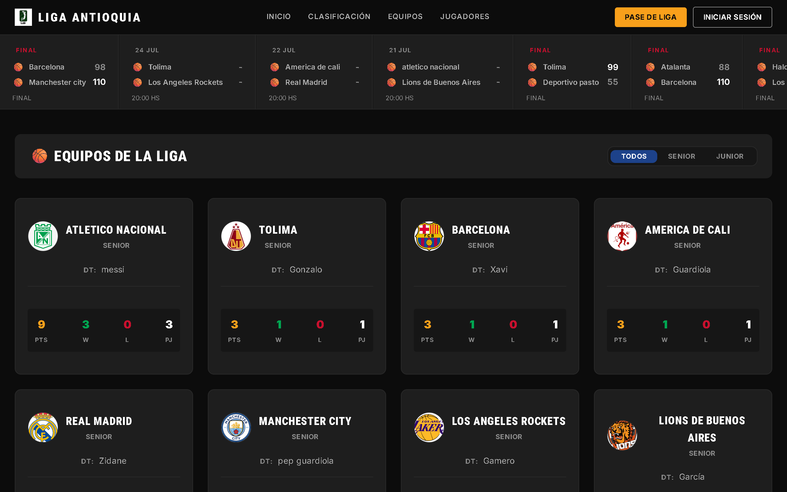 |
| 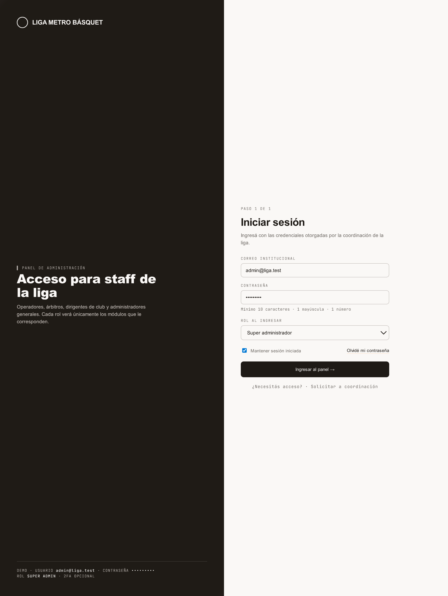 | 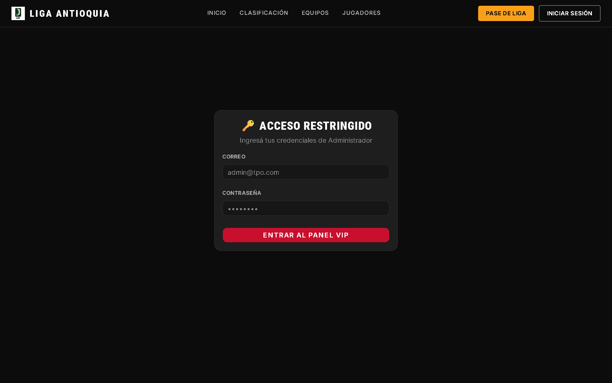 |
| 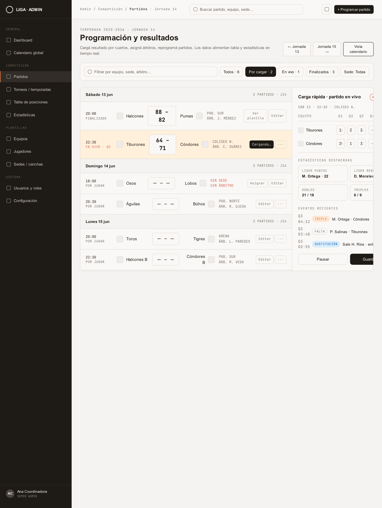 |  |
| 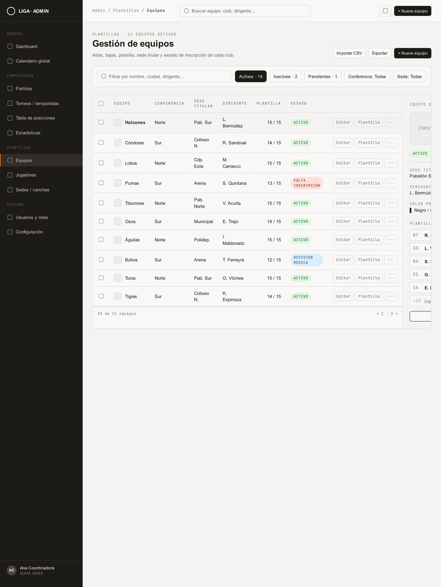 | 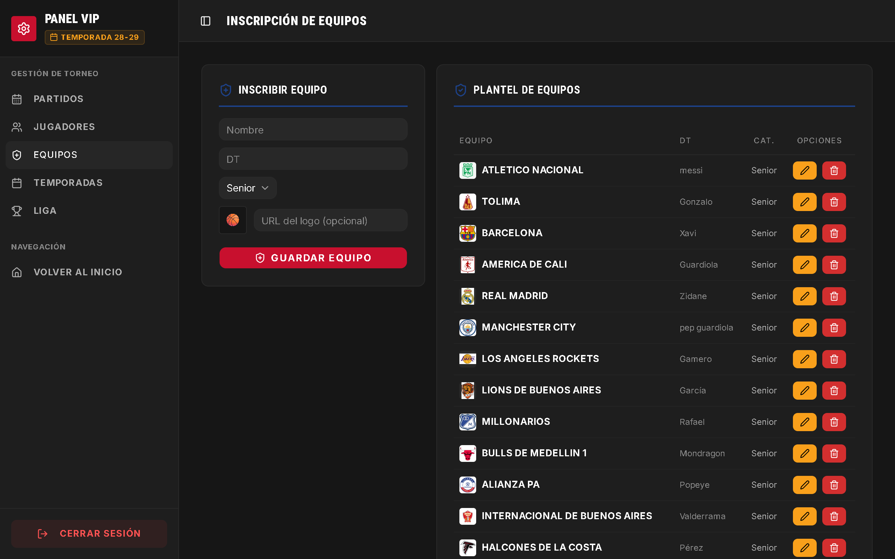 |

> La estética final adoptó la identidad visual de NBA.com (fondo oscuro, tipografía condensada, acentos rojo/dorado) sobre la estructura planteada en el wireframe.

---

## 🛠 Stack tecnológico

| Capa | Tecnologías |
|---|---|
| **Frontend** | React 19 · Vite · React Router 7 · Tailwind CSS v4 · shadcn/ui (sobre @base-ui/react) · lucide-react · sonner |
| **Backend** | Node.js · Express 5 · JWT (jsonwebtoken) · bcrypt · express-rate-limit |
| **Base de datos** | PostgreSQL alojado en **Supabase** (pg / node-postgres con Pool) |
| **Tooling** | ESLint · migraciones SQL versionadas con runner propio |

---

## 🏗 Arquitectura

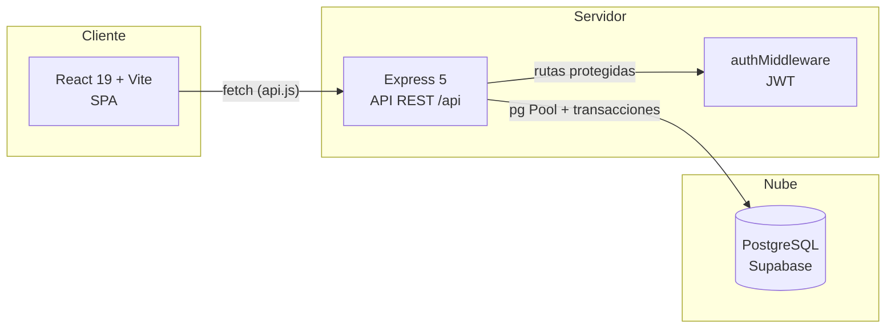
```mermaid
flowchart LR
    subgraph Cliente
        A[React 19 + Vite<br/>SPA]
    end
    subgraph Servidor
        B[Express 5<br/>API REST /api]
        M[authMiddleware<br/>JWT]
    end
    subgraph Nube
        D[(PostgreSQL<br/>Supabase)]
    end
    A -- "fetch (api.js)" --> B
    B -- "rutas protegidas" --> M
    B -- "pg Pool + transacciones" --> D
```

- **Backend en capas**: rutas → middleware de auth → controllers → base de datos. Las operaciones críticas (cargar resultado, crear temporada) usan **transacciones ACID reales** sobre una conexión dedicada del pool.
- **Frontend feature-based**: el dominio vive en `features/` (matches, players, teams, auth, settings, admin), las vistas en `pages/`, la UI compartida en `components/`. Un servicio HTTP central (`services/api.js`) maneja token y errores 401 en un solo lugar.

---

## 🗄 Base de datos

Modelo entidad-relación (7 tablas):

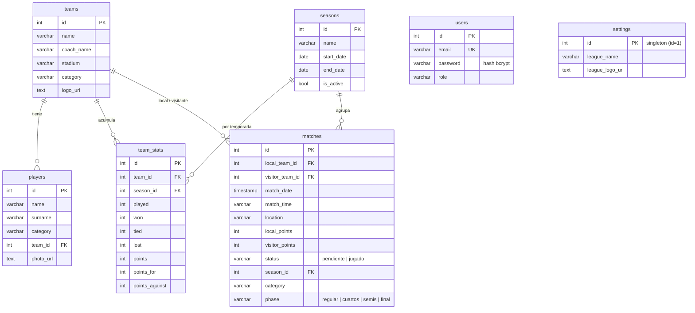
```mermaid
erDiagram
    teams ||--o{ players : "tiene"
    teams ||--o{ team_stats : "acumula"
    seasons ||--o{ team_stats : "por temporada"
    seasons ||--o{ matches : "agrupa"
    teams ||--o{ matches : "local / visitante"

    teams {
        int id PK
        varchar name
        varchar coach_name
        varchar stadium
        varchar category
        text logo_url
    }
    players {
        int id PK
        varchar name
        varchar surname
        varchar category
        int team_id FK
        text photo_url
    }
    matches {
        int id PK
        int local_team_id FK
        int visitor_team_id FK
        timestamp match_date
        varchar match_time
        varchar location
        int local_points
        int visitor_points
        varchar status "pendiente | jugado"
        int season_id FK
        varchar category
        varchar phase "regular | cuartos | semis | final"
    }
    seasons {
        int id PK
        varchar name
        date start_date
        date end_date
        bool is_active
    }
    team_stats {
        int id PK
        int team_id FK
        int season_id FK
        int played
        int won
        int tied
        int lost
        int points
        int points_for
        int points_against
    }
    users {
        int id PK
        varchar email UK
        varchar password "hash bcrypt"
        varchar role
    }
    settings {
        int id PK "singleton (id=1)"
        varchar league_name
        text league_logo_url
    }
```

La base está desplegada en **Supabase** (esquema real visto desde el Schema Visualizer y el Table Editor):

| Schema Visualizer | Datos reales (matches) |
|---|---|
| 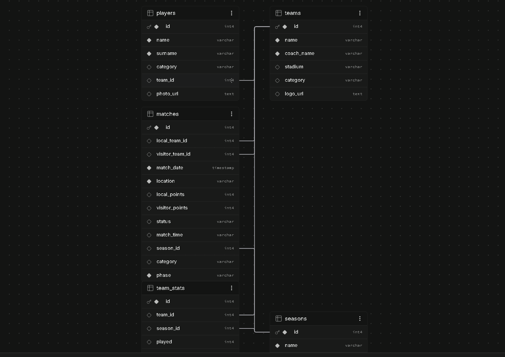 | 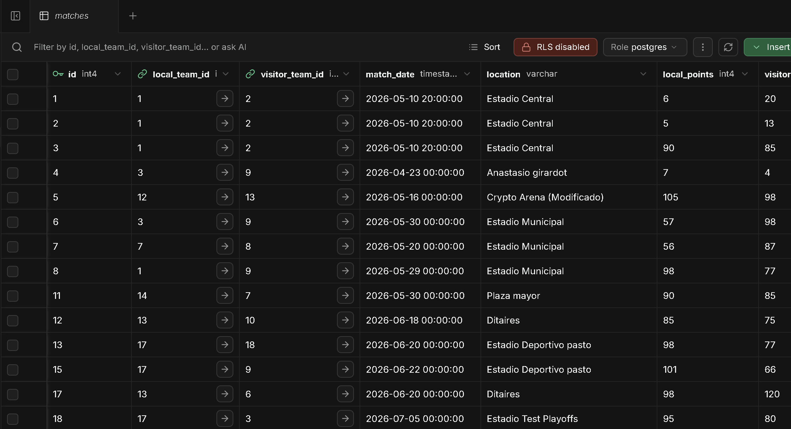 |
| 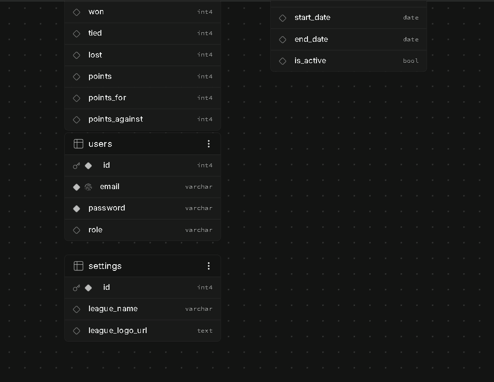 | 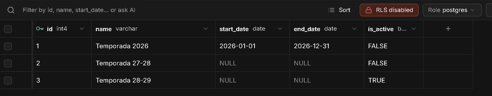 |

**Migraciones**: los cambios de esquema son scripts SQL idempotentes en `backend/migrations/`, aplicados con el runner propio:

```bash
cd backend
node migrations/run.js 002_images.sql    # photo_url, logo_url, tabla settings
node migrations/run.js 003_playoffs.sql  # columna matches.phase
```

---

## Instalación y ejecución

**Requisitos**: Node.js 18+, una base PostgreSQL (local o Supabase).

```bash
# 1. Clonar
git clone https://github.com/Crisoan2025/Proyectos.git
cd Proyectos

# 2. Backend
cd backend
npm install
# Crear .env con:
#   DATABASE_URL=postgres://...   (Supabase)  — o las variables locales:
#   DB_USER=... DB_HOST=... DB_NAME=... DB_PASSWORD=... DB_PORT=5432
#   JWT_SECRET=un_secreto_seguro
npm run dev          # http://localhost:3000

# 3. Frontend (en otra terminal)
cd frontend
npm install
npm run dev          # http://localhost:5173
# Opcional: VITE_API_URL si el backend no está en localhost:3000
```

El panel admin requiere un usuario en la tabla `users` (contraseña hasheada con bcrypt).

---

## 🔌 API — Resumen de endpoints

| Método | Ruta | Auth | Descripción |
|---|---|---|---|
| POST | `/api/auth/login` | — (rate limited 5/15min) | Login del admin → JWT (expira en 1 h) |
| GET | `/api/equipos` | — | Standings por temporada activa (`?category=`, `?season_id=`) |
| GET | `/api/equipos/:id` | — | Detalle de equipo + roster |
| POST / PUT / DELETE | `/api/equipos[/:id]` | 🔐 | CRUD de equipos (alta crea stats en 0) |
| GET | `/api/jugadores` | — | Jugadores con nombre de equipo |
| POST / PUT / DELETE | `/api/jugadores[/:id]` | 🔐 | CRUD de jugadores (valida categoría vs equipo) |
| GET | `/api/partidos` | — | Fixture (`?category=`, `?season_id=`, `?phase=`) |
| POST | `/api/partidos` | 🔐 | Programar partido (acepta `phase`) |
| PUT | `/api/partidos/:id` | 🔐 | Reprogramar / cambiar fase |
| PUT | `/api/partidos/:id/resultado` | 🔐 | Cargar resultado (regular: actualiza standings en transacción; playoffs: no suma y rechaza empates) |
| DELETE | `/api/partidos/:id` | 🔐 | Cancelar partido (revierte stats si era regular jugado) |
| GET | `/api/temporadas` · `/activa` · `/campeones` | — | Temporadas, temporada activa y palmarés de campeones |
| POST | `/api/temporadas` | 🔐 | Nueva temporada (desactiva la anterior, stats en 0) |
| GET / PUT | `/api/settings` | — / 🔐 | Branding global de la liga (nombre + logo) |

---

## 📁 Estructura del proyecto

```
├── backend/
│   ├── migrations/          # SQL versionado + runner (run.js)
│   └── src/
│       ├── controllers/     # Lógica de negocio (equipos, jugadores, partidos, temporadas, settings, auth)
│       ├── routes/          # Definición de endpoints y protección por ruta
│       ├── middlewares/     # authMiddleware (verificación JWT)
│       ├── helpers/         # seasonHelper (temporada activa)
│       ├── db.js            # Pool de PostgreSQL (Supabase o local)
│       └── index.js         # App Express + registro de rutas
├── frontend/
│   └── src/
│       ├── features/        # Dominio: matches, players, teams, auth, settings, admin
│       ├── pages/           # Vistas públicas + secciones del admin (rutas reales)
│       ├── components/      # PlayoffBracket, CategoryFilter, NavigationBar + ui/ (shadcn)
│       ├── hooks/           # useApi (fetch con loading/error/reload)
│       └── services/api.js  # Cliente HTTP central (token + manejo de 401)
└── docs/                    # Imágenes de documentación (wireframes, capturas, BD)
```

---

## 📚 Documentación adicional

- [`backend/DOCUMENTACION_TECNICA.md`](backend/DOCUMENTACION_TECNICA.md) — documentación técnica detallada del backend (esquema completo, flujos, decisiones)
- [`frontend/DOCUMENTACION_FRONTEND.md`](frontend/DOCUMENTACION_FRONTEND.md) — documentación técnica del frontend (arquitectura, flujo de datos, patrones)
- [`HANDOFF.md`](HANDOFF.md) — bitácora de desarrollo: sesiones de trabajo, bugs encontrados y corregidos, decisiones de diseño
- [Wireframe original (PDF)](docs/img/wireframes/wireframe-liga-basquet.pdf) — prototipo mid-fi previo al desarrollo

---

*Proyecto académico (TPO) — 2026.*
