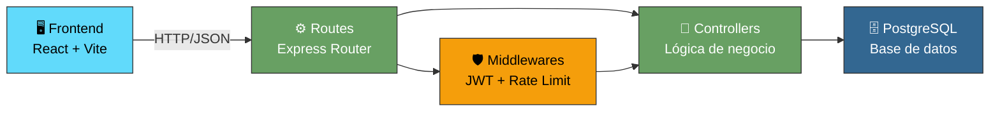
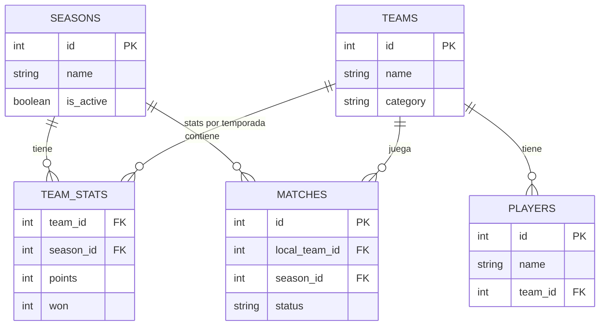
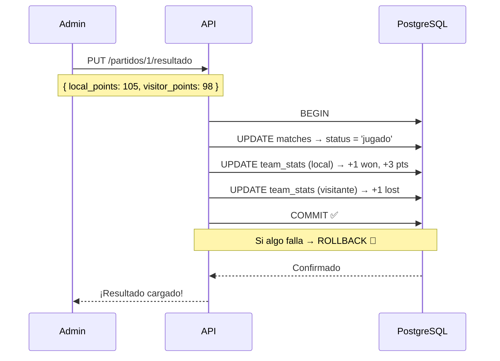

# 🏀 Liga de Baloncesto

### API REST con Node.js, Express y PostgreSQL

<div class="abs-br m-6 text-xl">
  TPO — Trabajo Práctico Obligatorio
</div>

---
transition: fade-out
---

# 📋 Agenda

<v-clicks>

1. 🎯 **Objetivo del Proyecto** — ¿Qué problema resuelve?
2. 🛠️ **Stack Tecnológico** — Herramientas utilizadas
3. 🏗️ **Arquitectura MVC** — Cómo está organizado
4. 🔐 **Seguridad** — 4 capas de protección
5. 🗄️ **Base de Datos** — Modelo relacional
6. 📡 **API REST** — Endpoints y funcionalidades
7. ⚡ **Lógica de Negocio** — Transacciones ACID
8. 📅 **Sistema de Temporadas** — Segmentación de datos
9. 🖥️ **Demo** — Funcionamiento en vivo

</v-clicks>

---
layout: two-cols
layoutClass: gap-16
---

# 🎯 Objetivo del Proyecto

Desarrollar una **API REST** que permita gestionar una liga de baloncesto completa:

<v-clicks>

- ✅ Administrar **equipos** con categorías
- ✅ Fichar y transferir **jugadores**
- ✅ Programar y gestionar **partidos**
- ✅ Cargar **resultados** y actualizar standings
- ✅ Segmentar por **temporadas**
- ✅ Autenticación segura para **administradores**

</v-clicks>

::right::

<div class="mt-10">

```
📊 Tabla de Posiciones
┌────────────────────────┐
│ #  Equipo     Pts  Dif │
│ 1  Halcones    15  +32 │
│ 2  Lions       12  +18 │
│ 3  Tigres       9  +5  │
│ 4  Bulls        6  -8  │
│ 5  Rockets      3  -15 │
└────────────────────────┘
```

</div>

---

# 🛠️ Stack Tecnológico

<div class="grid grid-cols-2 gap-8 mt-8">

<div>

### Backend
| Tecnología | Propósito |
|---|---|
| **Node.js** | Runtime del servidor |
| **Express 5** | Framework HTTP |
| **PostgreSQL** | Base de datos relacional |
| **JWT** | Autenticación stateless |
| **bcrypt** | Encriptación de passwords |

</div>

<div>

### Frontend
| Tecnología | Propósito |
|---|---|
| **React** | Interfaz de usuario |
| **Vite** | Bundler ultra-rápido |
| **React Router** | Navegación SPA |
| **Context API** | Estado global |
| **CSS** | Estilos |

</div>

</div>

---
layout: center
---

# 🏗️ Arquitectura MVC



---

# 📁 Estructura del Proyecto

```
backend/src/
├── index.js                  ← Punto de entrada
├── db.js                     ← Conexión a PostgreSQL
├── controllers/              ← El "cerebro" de cada entidad
│   ├── authController.js         → Login + JWT
│   ├── equiposController.js      → CRUD equipos + standings
│   ├── jugadoresController.js    → CRUD jugadores
│   ├── partidosController.js     → CRUD partidos + resultados
│   └── temporadasController.js   → Gestión de temporadas
├── routes/                   ← Definición de URLs
├── middlewares/              ← Seguridad (verificarToken)
└── helpers/                  ← Funciones reutilizables (DRY)
    └── seasonHelper.js           → getActiveSeasonId()
```

---

# 🔐 Seguridad — 4 Capas

<v-clicks>

### 1. 🔑 Contraseñas encriptadas (bcrypt)
Jamás se guardan en texto plano. Se comparan versiones hasheadas.

### 2. 🎫 Tokens JWT con expiración
"Pase VIP" temporal de 1 hora. Autenticación **stateless**.

### 3. ⏱️ Rate Limiting
Máximo 5 intentos de login cada 15 minutos por IP.

### 4. 💉 Anti SQL Injection
Queries parametrizadas (`$1, $2`) en **todas** las consultas.

</v-clicks>

---

# 🗄️ Modelo de Base de Datos



---

# 📡 Endpoints de la API

| Método | Ruta | Protegida | Descripción |
|---|---|---|---|
| `POST` | `/api/auth/login` | 🔓 Rate Limited | Login del admin |
| `GET` | `/api/equipos` | 🔓 | Tabla de posiciones |
| `POST` | `/api/equipos` | 🔒 | Crear equipo |
| `GET` | `/api/jugadores` | 🔓 | Listar jugadores |
| `POST` | `/api/partidos` | 🔒 | Programar partido |
| `PUT` | `/api/partidos/:id/resultado` | 🔒 | Cargar resultado |
| `GET` | `/api/temporadas` | 🔓 | Listar temporadas |

<v-click>

**Total: 18 funciones** — 15 endpoints + 1 middleware + 1 helper + 1 error handler global

</v-click>

---
layout: center
---

# ⚡ Transacción ACID — Cargar Resultado



---

# 📅 Sistema de Temporadas

<div class="grid grid-cols-2 gap-8">

<div>

### ¿Por qué?
- Las estadísticas se **segmentan por temporada**
- Se puede consultar el **historial**
- Al crear una nueva temporada, las stats se **reinician en 0**
- Los equipos se separan por **categoría** (Senior / Junior)

</div>

<div>

### ¿Cómo funciona?
```
Admin crea "Temporada 2027"
        ↓
Se desactiva "Temporada 2026"
        ↓
Se crean stats en 0 para todos
los equipos (1 solo query SQL)
        ↓
Nuevos partidos se asocian
a la temporada activa
```

</div>

</div>

---
layout: center
class: text-center
---

# 🖥️ Demo en Vivo

### Postman + Frontend React

<div class="mt-8 text-gray-400">

*Abrir Postman y mostrar los endpoints funcionando*

</div>

---
layout: center
class: text-center
---

# 🏀 ¡Gracias!

### ¿Preguntas?

<div class="mt-8">

**Stack:** Node.js · Express · PostgreSQL · React · JWT

**Repo:** github.com/Crisoan2025/Proyectos

</div>
